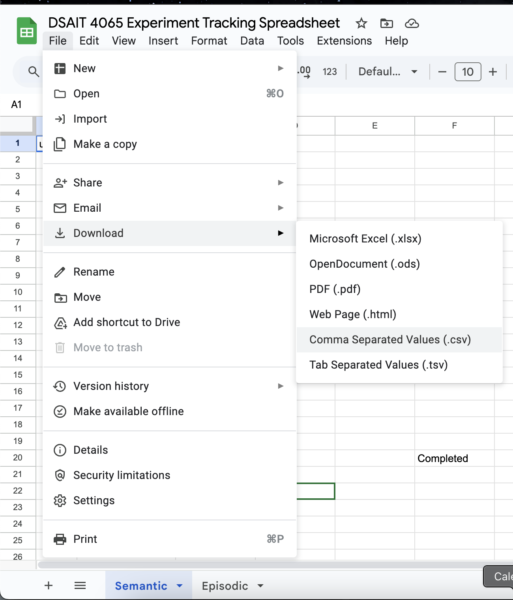

# This folder contains the evaluation of our experiment

### For researchers

As of the time when I was setting up the evaluation notebook, our experiment hadn't finished. The data I was working with
is incomplete and we need to get the latest data from our experiment.

If you're reading this after 7 April 2025, you can skip the following steps.

Download the individual sheets (both semantic \& episodic) from the "DSAIT 4065 Experiment Tracking Spreadsheet" as csv.


Do the same for the "Survey Questionnaire for AI-Based TV Show/Movie Recommendations (Responses)".

You should have 3 csv files, all should be in the `data/` folder.
Please make sure your files are named as follows:

```zsh
DSAIT 4065 Experiment Tracking Spreadsheet - Episodic.csv
DSAIT 4065 Experiment Tracking Spreadsheet - Semantic.csv
Survey Questionnaire for AI-Based TV Show_Movie Recommendations (Responses) - Form Responses 1.csv
```

For privacy reasons, we don't push the tracking spreadsheet data to GitHub.

There could be extra files there, namely, `Survey_Episodic.csv` and `Survey_Semantic.csv`, these are just processed files that
are generated through the notebook, ignore them and let them be if you're not sure what they're for.
